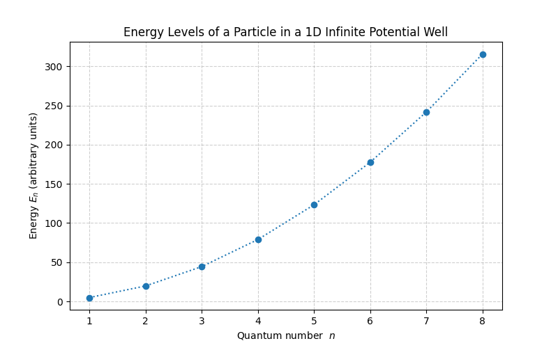
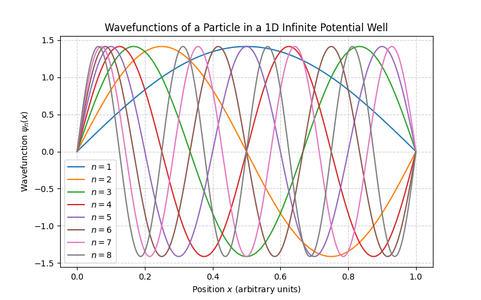

# Particle in a Box Simulation

A Python simulation of a quantum particle confined in a one-dimensional infinite potential well ("particle in a box").  
This project computes the energy levels, wavefunctions, and probability densities of a particle for different quantum numbers, and visualizes the effects of varying the box length and particle mass.

## Motivation

This project demonstrates fundamental concepts of quantum mechanics, including quantized energy levels, wavefunctions, and probability densities.  
It provides a computational and visual understanding of how a particle behaves in a confined space.

## Features

- Compute energy levels for multiple quantum numbers.
- Calculate wavefunctions ψ_n(x) for each quantum number.
- Plot probability density |ψ_n(x)|².
- Check normalization of wavefunctions.
- Analyze the effect of changing box length L on energy levels.
- Analyze the effect of changing particle mass m on energy levels.
- Fully visualized results using Matplotlib.

## Requirements

- Python 3.x  
- NumPy  
- Matplotlib  

## Installation

1. Clone the repository or download the project folder.  
2. Install the required dependencies:  
   ```bash
   pip install numpy matplotlib
   ```

## Usage

1. Open the project folder:  
   ```
   C:\Users\Zohaib Hassan\Downloads\Projects\Particle Box\
   ```
2. Run the script:
   ```bash
   python "C:\Users\Zohaib Hassan\Downloads\Projects\Particle Box\particle_in_box.py"
   ```
3. Modify parameters inside the script if needed:
   - `L` : Length of the box
   - `m` : Particle mass
   - `n_max` : Maximum quantum number

## Results

### Energy Levels


### Wavefunctions


### Probability Densities


### Effect of Box Length L


### Effect of Particle Mass m
