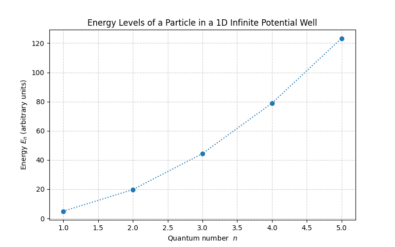
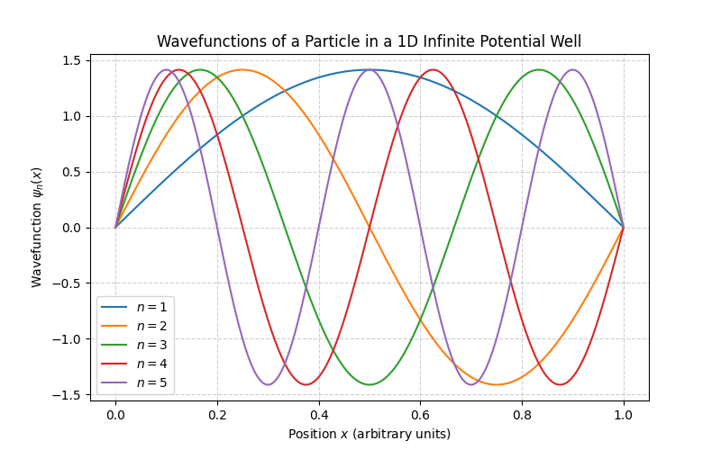
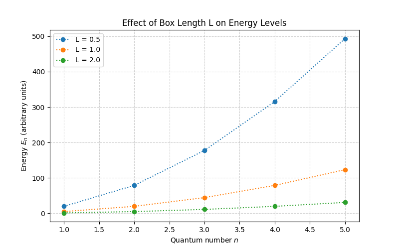
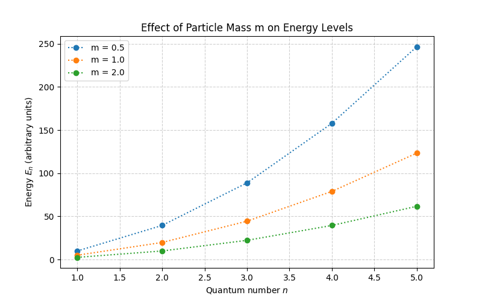

# Particle in a Box Simulation

A Python simulation of a **quantum particle confined in a one-dimensional infinite potential well** (“particle in a box”).  

This project **computes energy levels, wavefunctions, and probability densities** for different quantum numbers, and visualizes the effects of **box length (L)** and **particle mass (m)**.

---

## Motivation

Quantum mechanics introduces **quantized energy levels** and **wavefunctions** for particles in confined spaces.  

This simulation provides a **computational and visual approach** to understanding:

- Energy quantization  
- Wavefunctions ψₙ(x)  
- Probability densities |ψₙ(x)|²  
- The effect of **box length** and **particle mass** on energy levels  

This project aims to make **abstract quantum concepts visual and intuitive**.

---

## Features

- Compute **energy levels** for multiple quantum numbers  
- Generate **wavefunctions** ψₙ(x)  
- Plot **probability densities** |ψₙ(x)|²  
- Verify **normalization** of wavefunctions  
- Analyze the effect of **box length (L)** and **particle mass (m)**  
- Modular and reusable **Python code**  
- High-quality visualizations using **Matplotlib**

---

## Requirements

- Python 3.x  
- NumPy  
- Matplotlib  

Install dependencies with:

```bash
pip install numpy matplotlib
```

---

## Usage

1. Clone the repository:

```bash
git clone <your-repo-link>
```

2. Navigate to the project folder:

```bash
cd Particle_in_a_Box
```

3. Run the simulation:

```bash
python Particle_in_a_Box.py
```

4. Optional: Modify parameters directly in the script:  

- `L` : Length of the box  
- `m` : Particle mass  
- `n_max` : Maximum quantum number  

---

## Outputs

### Energy Levels


### Wavefunctions


### Probability Densities


### Effect of Box Length L


### Effect of Particle Mass m


---

## Normalization Check

The integral of |ψₙ(x)|² over the box should equal 1:

```
Normalization check (should be 1):
n = 1, ∫|ψ_n(x)|^2 dx = 1.000000
n = 2, ∫|ψ_n(x)|^2 dx = 1.000000
...
```

---

## References

1. Griffiths, D. J., *Introduction to Quantum Mechanics*, 2nd Edition  
2. Python documentation: [NumPy](https://numpy.org), [Matplotlib](https://matplotlib.org)  